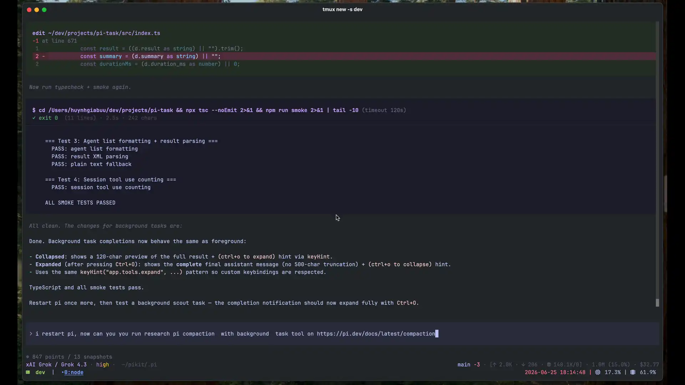

# @heyhuynhgiabuu/pi-task

Delegating task/subagent extension for [Pi](https://pi.dev). It adds a `task` tool that can run specialized subagents in foreground or background, show task progress in the TUI, and deliver background completion back to the parent assistant.

## Demo



_Auto-playing preview of the 89s walkthrough (1 fps): spawning a background subagent in a tmux pane, watching the live tool-call progress in the parent pane, and reading the final result via the session JSONL._

For the full high-quality 89s @ 56 fps version, [download the MP4](https://github.com/heyhuynhgiabuu/pi-task/releases/download/v0.2.0/demo-background-task.mp4).

## Features

- Foreground tasks: parent waits and receives the subagent result directly.
- Background tasks: parent continues, task widget shows progress, completion arrives as a follow-up.
- Herdr and tmux backends for observable subagent panes.
- Pi SDK fallback for headless environments without an available pane backend.
- Agent frontmatter support: `model`, `thinking`, `tools`, `disallowed_tools`.
- Built-in starter agents: `scout`, `explore`, `planner`, `reviewer`, `vision`, `worker`.
- Project/user agent overrides via `.pi/agents/*.md` or `~/.pi/agents/*.md`.

## Install

```bash
pi install npm:@heyhuynhgiabuu/pi-task
```

Latest release: https://github.com/heyhuynhgiabuu/pi-task/releases/latest

Or load locally:

`pi -e ./src/index.ts`

Restart Pi after installing or changing extension config.

## Usage

Foreground task:

```json
{
  "agent_type": "explore",
  "description": "Find auth flow",
  "background": false,
  "backend": "auto",
  "prompt": "Map the auth flow. Do not edit files. Return file:line evidence."
}
```

Background task:

```
{
  "agent_type": "scout",
  "description": "Research SDK docs",
  "background": true,
  "prompt": "Research the latest Pi SDK extension APIs. Cite official docs."
}
```

Durable specialist conversation:

```
{
  "agent_type": "scout",
  "conversation_id": "research-ai",
  "description": "Ask research assistant",
  "background": false,
  "prompt": "Continue our prior research thread. What did we conclude about retrieval evaluation?"
}
```

`conversation_id` maps to a durable subagent run. Reuse it across calls to keep
specialist memory, for example as a reusable research assistant. Use
`/task-sessions` to list known durable conversations.

Stored files (all flat at the top of `.pi/artifacts/`, with no per-task
subdirectories):

```
.pi/artifacts/TASKS.md              # one ### <task-id> block per task
.pi/artifacts/task-sessions.json    # conversation_id -> { task_id, session_file }
```

The subagent's session is auto-saved by Pi at
`~/.pi/agent/sessions/<cwd>/<session-id>.jsonl`. pi-task reads the last
assistant message from there to populate `#### Result` in `TASKS.md`. The
subagent's final message is the result; no separate result file is required.

True conversation resume requires a CLI pane backend (`herdr` or `tmux`) so Pi
can reopen the saved subagent session. The SDK backend can run one-shot tasks,
but it cannot resume a prior Pi CLI session.

## Forking parent context

`fork_context: true` on `task` (and `task_batch`) forks the main agent's
current Pi session and gives the subagent the full parent conversation
history.  It is useful when the subagent needs to continue from the
parent's context instead of receiving a self-contained prompt.

It requires the parent session to be persisted (i.e., Pi must be saving
its session to disk).  With `--no-session` or an otherwise unsaved
session, `fork_context` returns an error.

Examples:

```json
{
  "agent_type": "explore",
  "description": "Continue codebase investigation",
  "fork_context": true,
  "prompt": "Look at the auth changes we just discussed and find where the password hashing is configured."
}
```

```json
{
  "fork_context": true,
  "tasks": [
    {
      "agent_type": "explore",
      "description": "Investigate auth flow",
      "prompt": "Using the prior conversation, trace the login flow."
    },
    {
      "agent_type": "reviewer",
      "description": "Review auth changes",
      "prompt": "Using the prior conversation, review the recent auth-related edits."
    }
  ]
}
```

Notes:

- `fork_context` is ignored when `task_id` or `conversation_id` is
  provided (resume paths take precedence).
- `tool_uses` and `turn_count` reported in task results only reflect the
  subagent's own work after the fork, not the parent's history.
- The subagent still receives `PI_TASK_TOOL_DISABLED=1`, so it cannot
  recursively call `task`.

## Backend selection

The optional `backend` field accepts `"auto"`, `"herdr"`, `"tmux"`, or
`"sdk"`. It defaults to `"auto"`.

In auto mode, pi-task selects the first available backend in this order:

1. Herdr, when running inside Herdr (`HERDR_ENV=1`) and the `herdr` CLI works.
2. Tmux, when the `tmux` CLI works.
3. The Pi SDK fallback.

The `herdr` and `tmux` backends launch the Pi CLI in an observable pane and
support durable conversation resume. The `sdk` backend runs without a pane and
is intended for one-shot work in headless, CI, and RPC environments. Selecting
an unavailable pane backend explicitly returns an error instead of silently
using another backend.

## Agent precedence

When two agents have the same name, later sources override earlier ones:

1. bundled agents from this package
2. user agents: `~/.pi/agents/*.md`
3. project agents: `.pi/agents/*.md`

## Agent frontmatter

```md
---
description: Local read-only code explorer
model: opencode-go/deepseek-v4-flash
thinking: off
tools: read, grep, find, ls
disallowed_tools: edit, write
prompt_mode: append
---

# Agent instructions
```

`tools:` is an explicit allowlist. If omitted, pi-task starts from the tools actually registered in the parent Pi session, then removes `disallowed_tools`. Recursive `task` delegation is always blocked.

Bundled agents rely on built-in `read`, `grep`, `find`, `ls`, and safe read-only `bash` for navigation. When shell search is needed, they prefer `rg -n` / `rg -nF` over recursive grep.

## Development

```bash
npm install
npm run typecheck
npm test
npm run build
npm pack --dry-run
```

## Notes

- Herdr and tmux provide interactive pane observability.
- In environments without an available pane backend, auto mode falls back to
  the Pi SDK backend.
- Treat subagent results as untrusted until you read artifacts/files and verify claims.
